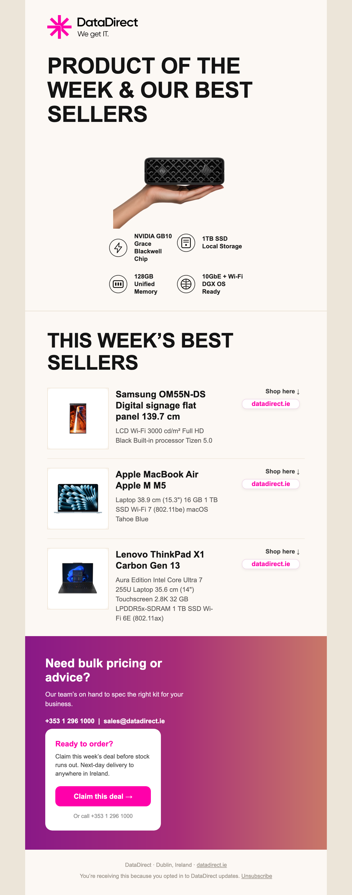
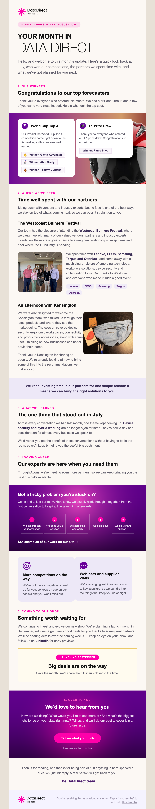

# DataDirect Email Templates

Production-ready, responsive HTML email templates for **DataDirect**, built from Figma designs.
Every template is table-based, works across **Outlook, Gmail, Apple Mail** and mobile/tablet, and is ready to paste into **HubSpot**.

## Templates

| Template | Folder | Preview |
|---|---|---|
| Product of the Week | [`product-of-the-week/`](product-of-the-week/) |  |
| Monthly Newsletter | [`monthly-newsletter/`](monthly-newsletter/) |  |

Each folder contains:
- `index.html` — the email (inline CSS + media queries + Outlook VML/ghost-tables)
- `images/` — all image assets (2× retina PNGs)
- `preview-desktop.png` / `preview-mobile.png` — rendered previews

## Engineering standards (applied to every template)

- **Layout:** 600px max width, table-based, `role="presentation"`.
- **Responsive:** fluid-hybrid columns using `min-width` (NOT media-query-only) so they still stack correctly in **Gmail iOS**, which ignores `<style>` media queries. Media queries layer on top as an enhancement.
- **Outlook (Windows):** MSO ghost tables, VML `roundrect` buttons, solid-colour fallbacks behind gradient sections.
- **Gmail / Apple Mail:** `<style>` in `<head>`, inline CSS, background-image sections.
- **Fonts:** Arial/Helvetica system stack (reliable everywhere).
- **Images:** exported at 2× and sized down via `width` for retina crispness.

## Brand tokens

| Token | Value |
|---|---|
| Magenta (primary) | `#FF00AA` |
| Deep purple | `#690099` |
| Cream background | `#FCF8F4` |
| Lavender card | `#EDE8F7` |
| Ink (headings) | `#141414` |
| Body text | `#5F5D6B` |

## Using a template in HubSpot

1. Upload the template's `images/` files to **HubSpot → Marketing → Files** (one folder per template).
2. In the `.html`, replace `src="images/..."` with the HubSpot CDN URLs (Find & Replace `src="images/` → your folder URL).
3. Paste the HTML into a HubSpot **Custom/Coded email**.
4. Replace `{{ unsubscribe_link }}` with HubSpot's unsubscribe token.
5. Send a **test email** and check on iPhone Gmail + Outlook before scheduling.

> Alternatively, if this repo is published with **GitHub Pages**, the `images/` are served at
> `https://<user>.github.io/datadirect-emails/<template>/images/...` and can be referenced directly.

## Adding a new template

Create a new folder `kebab-case-name/` with the same structure (`index.html`, `images/`, previews) and add a row to the table above.
